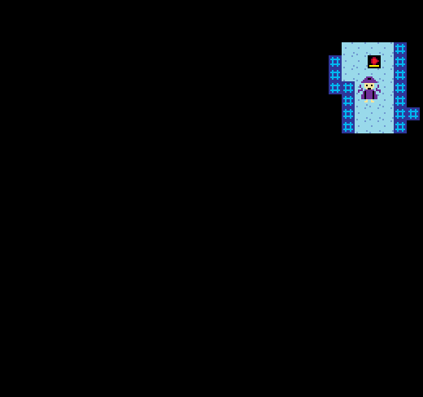

# Dark Escape

Author: Shengjian Chen

Design: Walking in the dark, you can only see close things. Can you find way out?

Screen Shot:

How Your Asset Pipeline Works:

There are 2 art work under `assets/`. One is background.png which denotes the map. Currently, it only support 32*30 size which means the map cannot scroll. Another is sprite.png, which should be an 8 x 8(x N) size big image, where each 8x8 is a tile. Each tile cannot have more than 3 (could be 4, but for true NES) unique colors.

Then `parse_sprite()` would read the image, load each 8x8 tile and write them to a local binary file. Each file starts with a magic name first (4 char) then follows 4 color infos. If it has less then 4 colors, pending with zero. Lastly, it concat with the pattern of tile. Directly store bit0s and bit1s.

After parse, PlayMode would read the binary and load them into sprite & pallete, also setup map.

How To Play:

Use directional key to control player to move up/down/left/right. You cannot pass the wall. Try to find the red flag to escape. (Though currently nothing will happen if you find red flag :< )

This game was built with [NEST](NEST.md).

